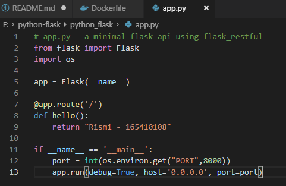
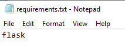
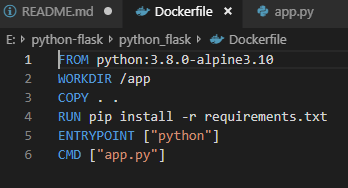
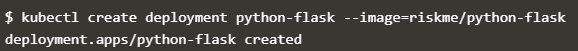
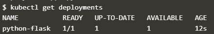
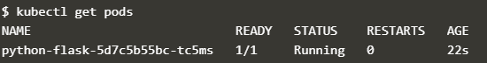
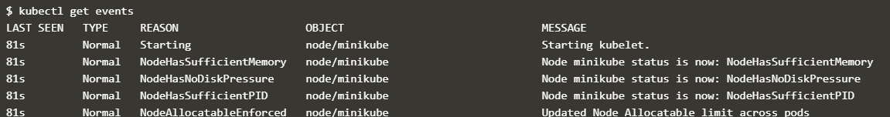
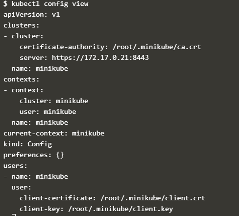
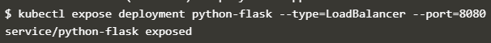

# Kubernetes dengan Python-Flask

Langkah2 :
1. Membuat file pyhton yang akan di gunakan, dan menjadikan nya docker images di hub.docker
 
 file app.py

 

 file requirement.txt

 

 file Dockerfile

 

2. Mengakses katacoda

Membuat cluster mikicube, dan menjalankan dashboard minikube

 

3. Membuat Pod dari Docker images yang ada di docker hub

kubectl create deployment python-flask --image=riskme/python-flask

4. melihat Deployments

kubectl get deployments

5. Melihat Pods

kubectl get pods

6. Melihat cluster

kubectl get events

7. melihat kubectl configuration

kubectl config view

8. melihat hasil nya

kubectl expose deployment python-flask --type=LoadBalancer --port=8080

